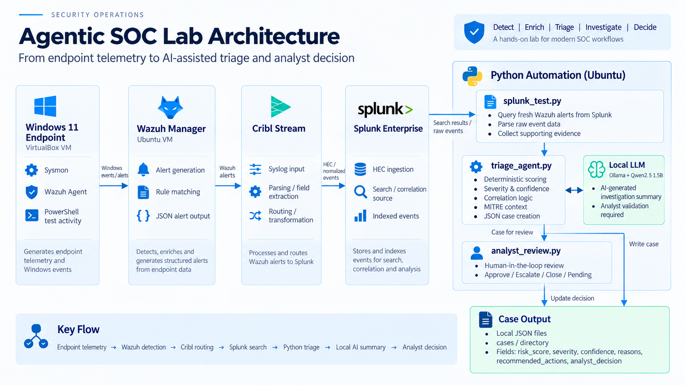
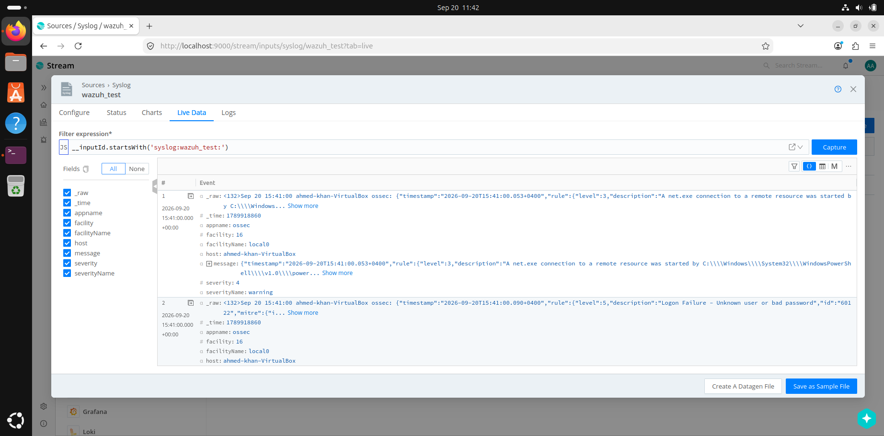
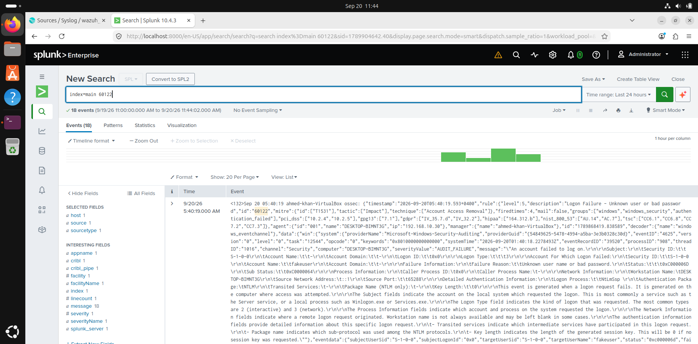
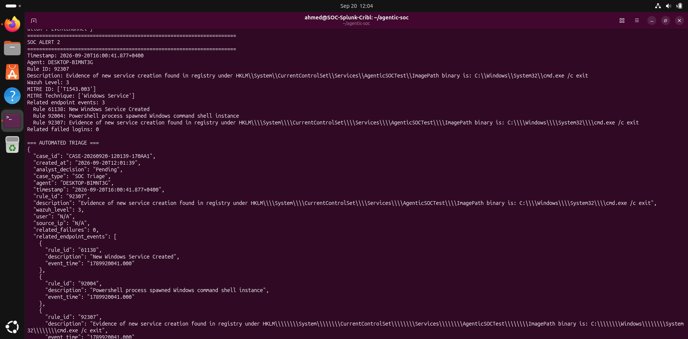
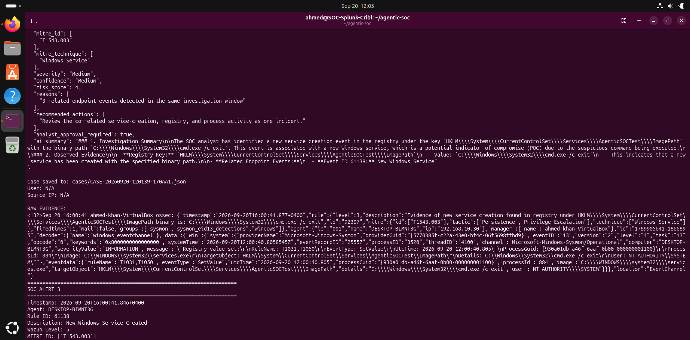
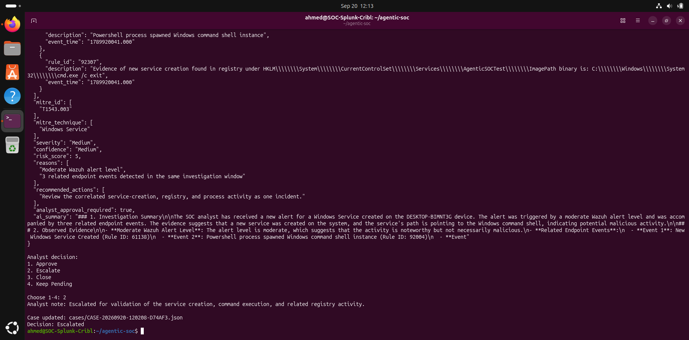

# Agentic SOC Lab

A hands-on security operations lab that combines Windows endpoint telemetry, Wazuh, Cribl, Splunk, Python, and a local LLM to create an AI-assisted SOC triage workflow.

The goal of the project is not to build a fully autonomous SOC. It is to demonstrate how repetitive alert investigation tasks can be automated while keeping deterministic scoring and analyst approval in the loop.

## Architecture



## Core Capabilities

- Collects Windows and Sysmon telemetry through Wazuh.
- Routes Wazuh alerts through Cribl into Splunk.
- Queries fresh alerts from Splunk through its REST API.
- Parses Wazuh JSON into structured SOC fields.
- Correlates repeated authentication failures.
- Correlates related endpoint activity around service creation.
- Applies deterministic risk scoring and severity classification.
- Maps Wazuh alerts to MITRE ATT&CK context where available.
- Generates evidence-bound investigation summaries using a local LLM.
- Saves structured SOC case files as JSON.
- Requires analyst approval before a case is escalated or closed.
- Runs locally using free/open-source or free-tier tooling.

## Human-in-the-Loop Design

The LLM does not control severity or risk scoring.

Severity, confidence, and risk score are calculated using deterministic Python logic. The local AI model is used only to:

- Summarize the investigation.
- Explain observed evidence.
- Suggest follow-up checks.
- Help the analyst understand correlated activity.

The AI prompt explicitly prevents it from:

- Inventing facts.
- Assuming malicious intent.
- Treating MITRE ATT&CK mappings as proof of compromise.
- Overriding the deterministic risk score.

All cases remain in a `Pending` state until reviewed by an analyst.

## Test Scenarios

### 1. Failed Login

Generated failed Windows authentication events and detected:

- Wazuh rule 60122
- Unknown user / bad password
- Windows Event ID 4625
- Target username
- Source IP
- MITRE ATT&CK context

The triage engine classified a single localhost test login as low risk.

### 2. Repeated and Privileged Account Failures

Repeated login failures were correlated by:

- Endpoint
- Username
- Time window

Targeting the `Administrator` account increased the risk score because a privileged account was involved.

Repeated failures also increased the risk score based on correlation count.

### 3. Windows Service Creation

Created a temporary Windows service to generate service-related telemetry.

The agent correlated:

- Rule 61138 — New Windows Service Created
- Rule 92307 — Service creation evidence in registry
- Rule 92004 — PowerShell spawned Windows command shell

These related events were grouped into one investigation context rather than treated as isolated alerts.

The resulting case was raised to Medium severity based on correlated endpoint activity.

## Evidence / Screenshots

### Wazuh Alerts Reaching Cribl



Cribl Live Data receiving real Wazuh syslog events, including failed-login alerts.

### Wazuh Events Indexed in Splunk



Splunk Enterprise searching indexed Wazuh rule `60122` events and displaying the underlying Windows authentication telemetry.

### Correlated Service-Creation Activity



The Python workflow correlates multiple related detections on the same endpoint, including:

- Rule `61138` — New Windows Service Created
- Rule `92004` — PowerShell spawned Windows command shell
- Rule `92307` — Service-creation evidence in the registry

### AI-Assisted Triage



The triage engine combines deterministic scoring, correlated evidence, recommendations, and a local AI-generated investigation summary.

### Human-in-the-Loop Review



The analyst reviews the generated case, adds an investigation note, and makes the final decision to escalate, approve, close, or keep the case pending.

## Case Workflow

Each alert generates a structured case containing:

- Case ID
- Creation timestamp
- Endpoint
- Wazuh rule
- Alert description
- Wazuh severity
- User
- Source IP
- Related failed logins
- Related endpoint events
- MITRE ATT&CK mapping
- Risk score
- Severity
- Confidence
- Reasons
- Recommended actions
- AI-generated investigation summary
- Analyst decision
- Analyst note

Cases are stored locally in JSON format.

Example analyst decisions:

- Pending
- Approved
- Escalated
- Closed

## Technology Stack
- Windows 11
- Sysmon
- Wazuh
- Cribl Stream
- Splunk Enterprise
- Python
- Ollama
- Qwen2.5 1.5B
- VirtualBox
- Ubuntu Linux

## Project Structure

```text
agentic-soc/
├── README.md
├── splunk_test.py
├── triage_agent.py
├── analyst_review.py
├── cases/
├── screenshots/
└── architecture/
```


## Key Files

### `splunk_test.py`

Queries Splunk for fresh Wazuh alerts, parses the raw event data, performs correlation, and sends the structured alert to the triage engine.

### `triage_agent.py`

Applies deterministic scoring, severity classification, correlation logic, case creation, and local AI-assisted investigation summaries.

### `analyst_review.py`

Allows an analyst to review saved cases and update the decision to:

- Approved
- Escalated
- Closed
- Pending

## Lessons Learned

This project involved troubleshooting several real integration issues, including:

- VirtualBox internal networking
- Windows static addressing
- Wazuh agent connectivity
- Cribl syslog listener problems
- Splunk TCP ingestion
- Splunk HEC configuration
- Event timestamp differences
- Field extraction from nested Wazuh JSON
- Correlation logic
- Local LLM memory constraints
- AI hallucination control

The lab reinforced the importance of validating each stage of a security telemetry pipeline independently rather than assuming that a healthy UI means events are flowing end to end.

## Limitations

This is a lab environment, not a production SOC.

Current limitations include:

- Small number of endpoints
- Limited detection scenarios
- No production threat-intelligence feeds
- No automated containment
- No enterprise identity baseline
- No long-term behavioral baseline
- Local LLM outputs still require analyst validation

The project intentionally keeps response actions human-approved.

## Future Improvements

Potential future additions:

- Additional Windows and Sysmon detections
- Successful-login-after-failures correlation
- Source-IP reputation enrichment
- Detection of suspicious PowerShell activity
- Threat-intelligence enrichment
- SQLite case database
- Lightweight analyst dashboard
- Automated case deduplication
- Additional MITRE ATT&CK enrichment

## Purpose

This project was built to develop practical SOC Analyst skills across:

- SIEM monitoring
- Log analysis
- Endpoint telemetry
- Alert triage
- Event correlation
- MITRE ATT&CK
- Investigation workflows
- Python automation
- AI-assisted security operations
- Human-in-the-loop incident handling
